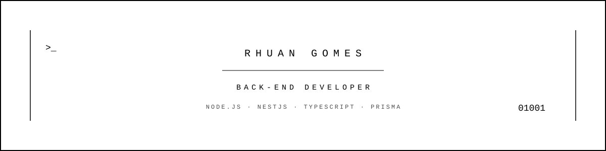

  

<h1 align="center">Rhuan Gomes</h1>
<h3 align="center">FullStack Developer</h3>

  

  

Construindo APIs back-end confiáveis com arquitetura limpa e soluções escaláveis.

<h2 align="center">🚀 Sobre mim</h2>

Sou o <b>Rhuan</b>, estudante de Sistemas de Informação pela UFRPE e Técnico em Informática para Internet pelo IFPE.

Atualmente atuo como <b>Analista de Projetos na Seed a Bit</b>, desenvolvendo APIs back-end com NestJS, TypeScript e Prisma.

Já fui monitor de Programação Orientada a Objetos (Java) no IFPE e conquistei o 5º lugar mundial no <b>Microsoft Office Specialist World Championship 2024</b> (Word).

Meu objetivo é simples: escrever código limpo, construir software confiável e crescer como desenvolvedor que entrega sistemas que duram.

<h2 align="center">🤝 Conecte-se</h2>

  
  &nbsp;&nbsp;&nbsp;
  
  &nbsp;&nbsp;&nbsp;
  

<h2 align="center">💻 Tech Stack</h2>

  

<h2 align="center">📊 GitHub Stats</h2>

  

<h2 align="center">📈 Activity Graph</h2>

  

